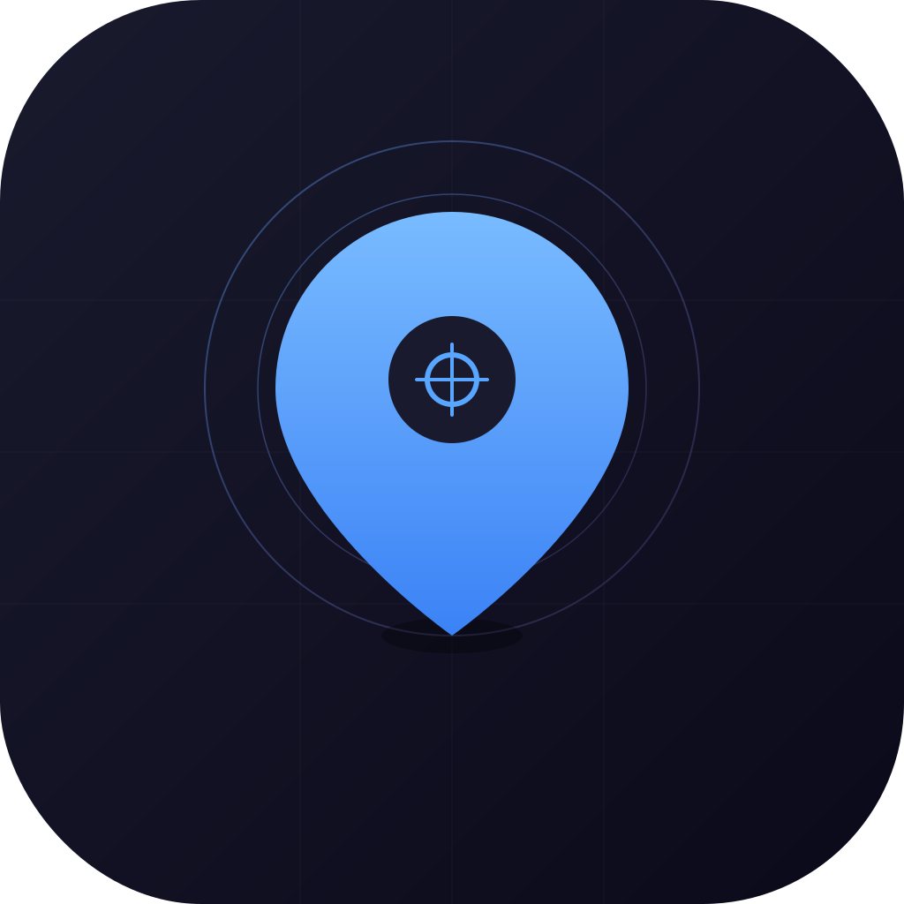

<p align="center">
  
</p>

<h1 align="center">iPhone Location Spoofer</h1>

<p align="center">
  <strong>Change your iPhone's GPS location from your Mac or PC.</strong><br>
  Works with <em>all</em> apps — Find My, Life360, Pokemon Go, Maps, Uber, and everything else.<br>
  No jailbreak. No paid tools. No API keys.
</p>

<p align="center">
  <a href="../../releases/latest"></a>
  
  
  
</p>

---

## How It Works

Your iPhone has a built-in developer feature that lets Xcode simulate GPS locations for app testing. This app uses [pymobiledevice3](https://github.com/doronz88/pymobiledevice3) — a proven open-source library — to access that same interface over USB. When you set a simulated location, the **entire iOS system** believes it's at those coordinates. Every app reads from the same CoreLocation framework, so Find My, Life360, Pokemon Go, and all other apps see the spoofed position.

**No jailbreak, no sideloading, no modifications to your iPhone.** Just plug in, click, and go.

## Features

| Feature | Description |
|---------|-------------|
| **Click to set** | Click anywhere on the map to set your GPS location |
| **Teleport mode** | Toggle to instantly move GPS with a single click — no confirm needed |
| **Search** | Find any address, city, or landmark worldwide |
| **Movement simulation** | Walk, bike, or drive along real roads at realistic speeds |
| **Paste coordinates** | Paste lat/lon or Google Maps URLs directly from clipboard |
| **Recent history** | Auto-tracked history of your last 15 locations |
| **Saved locations** | Bookmark your favorites for one-click access |
| **Popular spots** | Pre-loaded landmarks — Times Square, Eiffel Tower, Tokyo, and more |
| **Keep-alive** | iOS 18+ location maintained while phone stays connected |
| **Guided setup** | Step-by-step onboarding covers Developer Mode, USB trust, and usage |
| **Dark UI** | Apple-style minimal interface with dark map tiles |
| **Native window** | Runs as a native app window — no browser tab |

## Download

| Platform | Download | Requirements |
|----------|----------|-------------|
| **macOS** | [Download .dmg](../../releases/latest) | macOS 10.15+ |
| **Windows** | [Download .zip](../../releases/latest) | Windows 10/11 + [iTunes](https://www.apple.com/itunes/) |

**iPhone requirements:** iOS 17 or later, connected via USB, [Developer Mode](#enable-developer-mode) enabled.

## Quick Start

### 1. Install the app
- **macOS:** Open the `.dmg`, drag **iPhone Spoofer** to Applications
- **Windows:** Extract the `.zip`, run `iPhone Spoofer.exe`

### 2. Prepare your iPhone

<details>
<summary><strong>Enable Developer Mode</strong> (one-time setup)</summary>

1. Open **Settings** on your iPhone
2. Go to **Privacy & Security**
3. Scroll to the bottom and tap **Developer Mode**
4. Toggle it **ON**
5. Your iPhone will ask to restart — tap **Restart**
6. After reboot, confirm by tapping **Turn On**

> **Don't see Developer Mode?** It only appears on iOS 16+. Make sure your iPhone is updated.
</details>

<details>
<summary><strong>Trust your computer</strong></summary>

1. Connect your iPhone to your Mac/PC via **USB cable**
2. **Unlock** your iPhone
3. A dialog will appear: **"Trust This Computer?"** — tap **Trust**
4. Enter your iPhone **passcode** to confirm

> **No dialog?** Try unplugging and replugging the cable. If it still doesn't appear, go to Settings → General → Transfer or Reset → Reset Location & Privacy on your iPhone, then reconnect.
</details>

### 3. Use the app
1. Launch **iPhone Spoofer**
2. Accept the admin prompt (needed for the iOS tunnel)
3. Click the map to place a marker → click **Set Location**
4. Or enable **Teleport mode** in the top bar for instant one-click spoofing

### Resetting
Click **Reset** in the sidebar to return to your real GPS. On iOS 18+, simply unplugging the cable also resets.

## Supported Devices

| iPhone | iOS | Notes |
|--------|-----|-------|
| iPhone 8 – iPhone 16 Pro Max | iOS 17+ | Full support |
| iOS 18+ | iOS 18+ | Location resets when USB is disconnected — keep phone plugged in |
| iOS 16 and below | — | Not supported (Developer Mode required) |

## Development

For contributors or those who prefer the terminal:

```bash
# macOS — run in dev mode
sudo ./start.sh

# Windows — run in dev mode (as Administrator)
start.bat
```

### Building from source

```bash
# macOS → .app + .dmg
./build.sh

# Windows → .exe folder
build_windows.bat
```

### Tech stack

| Layer | Technology |
|-------|-----------|
| Device communication | [pymobiledevice3](https://github.com/doronz88/pymobiledevice3) (pure Python, v9.6+) |
| Backend | Python 3 + Flask |
| Map | [Leaflet.js](https://leafletjs.com/) + [CartoDB Dark](https://carto.com/basemaps/) tiles |
| Search | [Photon](https://photon.komoot.io/) + [Nominatim](https://nominatim.org/) (free, no API key) |
| Routing | [OSRM](http://project-osrm.org/) (free, no API key) |
| Native window | [pywebview](https://pywebview.flowrl.com/) |
| Packaging | [PyInstaller](https://pyinstaller.org/) |

### Project structure

```
├── app.py                 Flask API server (12 endpoints)
├── device_manager.py      iOS device connection via DVT/RSD
├── location_service.py    GPS spoofing, keep-alive, movement sim
├── tunnel_service.py      Cross-platform tunnel management
├── main_app.py            App entry point (WebView + Flask)
├── templates/index.html   UI layout
├── static/css/style.css   Apple-style dark theme
├── static/js/app.js       Map, search, controls, onboarding
├── build.sh               macOS build → .app + .dmg
├── build_windows.bat      Windows build → .exe
├── start.sh               macOS dev mode launcher
└── start.bat              Windows dev mode launcher
```

## FAQ

<details>
<summary><strong>Is this safe? Will it damage my iPhone?</strong></summary>

No. This uses Apple's own built-in developer debugging interface — the same one Xcode uses. No modifications are made to your iPhone. To stop spoofing, just click Reset or unplug your phone.
</details>

<details>
<summary><strong>Will I get banned from Pokemon Go?</strong></summary>

Pokemon Go has anti-cheat detection. To minimize risk: use movement simulation at walking speed (5 km/h), don't teleport between distant locations quickly, and wait a realistic "cooldown" time between jumps.
</details>

<details>
<summary><strong>Why does the app need my Mac password?</strong></summary>

The iOS developer tunnel requires root/admin access to create a network interface for communicating with your iPhone. This is a one-time prompt per session — the app does not store your password.
</details>

<details>
<summary><strong>My location keeps resetting (iOS 18+)</strong></summary>

Apple changed iOS 18 so that simulated locations reset when USB is disconnected. Keep your phone plugged in while spoofing. The app's keep-alive feature re-sends coordinates every 1.5 seconds to maintain the position.
</details>

<details>
<summary><strong>The app says "No device connected"</strong></summary>

1. Make sure your iPhone is connected via USB (not wireless)
2. Unlock your iPhone and check for a "Trust This Computer?" dialog
3. Verify Developer Mode is enabled (Settings → Privacy & Security → Developer Mode)
4. Try unplugging and replugging the cable
5. Restart the app
</details>

## License

MIT — free for personal and commercial use.
